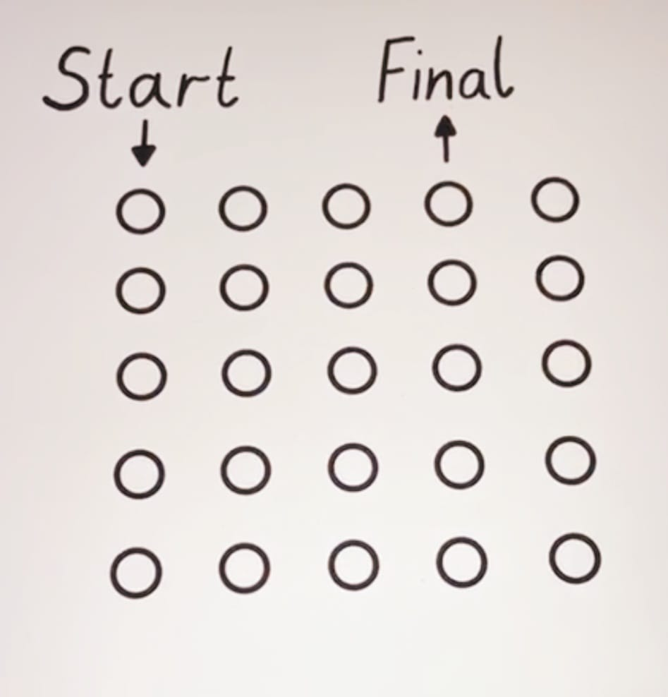

# game.clj
Il file game.clj, nella directory examples contiene l'implementazione di un tentativo di risolvere uno stupido giochino proposto dal mio amico Antonio su FB.

Il giochino è questo: . Bisogna entrare da **Start** e uscire a **Final** percorrendo la board occupando tutte le caselle e senza mai passare due volte dalla stessa. Ci si può muovere solo con angoli di 90 e 180 gradi (niente diagonali).

Dopo aver provato a risolverlo a mano e non essendo riuscito a trovare una soluzione ho provato a farlo con un programma. Quale occasione migliore per provare pyclj su un caso *reale* ?

A parte risolvere il gioco (o dimostrare che non ha soluzioni), avevo due scopi:
1. valutare quando è usabile pyclj (in effetti ho dovuto aggiungere qualche funzione)
2. valutare la compatibilità con Clojure (lo stesso programma doveva girare su entrambi)
3. fare un confronto tra le performance di pyclj e Clojure (e qui è stata una bella sorpresa)

## Il gioco
Ci sono, probabilmente, 1000 modi più furbi per provare a risolverlo, ma a me è venuto in mente questo:

- La board è rappresentata da un'array di 25 numeri.
- se una casella vale 0 indica che non ci siamo ancora passati
- una casella con valore n (da 1 a 25) indica che ci siamo passati nello step n.
- la board iniziale è questa `(def start (assoc (vec (map (fn [x] 0) (range 25))) 0 1))`.
     (*pyclj* non ha ancora la repeat, per cui non potevo usare `(repeat 25 0)`, che sarebbe stato più elegante).
- la posizione corrente è un numero da 0 a 24, e viene modificata dalle mosse che sono queste:
    ```
    (defn sinistra [n]
    (if (and (> n 0) (= (quot n 5) (quot (dec n) 5))) (dec n) nil))

    (defn destra [n]
    (if (= (quot n 5) (quot (inc n) 5)) (inc n) nil))

    (defn su [n]
    (if (> (- n 5) 0) (- n 5) nil))

    (defn giù [n]
    (if (< (+ n 5) 25) (+ n 5) nil))
    ```
    Queste funzioni tornano la nuova posizione (o nil se la mossa è illegale)
    
    Quelle orizzontali controllano che si resti nella stessa riga, una divisione intera per 5 `(quot pos 5)` mi dà la riga. Da notare che ho dovuto aggiungere quel test (> n 0) nell'implementazione di `sinistra`. Muovendosi a sinistra dalla posizione 0 si ottiene -1. Ora in Clojure (quot -1 5) torna 0, mentre in python `quot(-1, 5)` torna-1 (che tra l'altro mi sembra più giusto). La mia implementazione attuale di `quot` è direttamente la funzione python. Dovrò cambiarla.

    Quelle verticali controllano semplicemente che non si esca dalla board (numeri negativi o maggiori di 24)

-   La storia delle posizioni occupate nei vari step è contenuta nel `path`, un vettore che parte con `[0]`, la prima posizione, e diventerà di 25 numeri alla fine. Le mosse sono in ordine inverso: la prima posizione di path è l'ultima occupata.
-   La funzione `calc-moves` data una board, un path ed n (il numero di step corrente), calcola le possibili mosse, eliminando quelle che finiscono fuori dalla board (non possibili) e quelle occupate da precedenti mosse. Se `non-occupati` (il risultato di questa selezione), è vuota significa che da quella posizione non si può andare avanti e ritorna nil, se no, per ogni possibile mossa mette in un dizionario la nuova board (``:tavola`) e il nuovo path (`:path`), e torna un vettore di questi dizionari. Di crea nuovi rami di un albero: da ogni path vengono potenzialmete creati 4 nuovi rami. 
    ```
    (defn not-nil? [x] (not (nil? x)))

        (defn calc-moves [tavola path n]
        (let [pos (first path)
                moves [(su pos) (giù pos) (destra pos) (sinistra pos)]
                possibili (filter not-nil? moves)
                non-occupati (filter (fn [v] (= 0 (nth tavola v))) possibili)]
            (if (empty? non-occupati)
                nil
                (vec (map   (fn [new-pos] 
                                {:tavola (assoc tavola new-pos n) :path (cons new-pos path)}) 
                            non-occupati)))))
    ```
- `gioca` è il processamento dei 24 step dopo il primo. (il primo è `start`)
    
    É una funzione ricorsiva che chiama se stessa `25 - n` volte.
    Riceverà all'inizio il risultato della prima `calc-moves` (le prime due mosse che si possono fare dalla posizione 0). Chiamerà quindi `calc-moves` per ogni ramo. Non tengo traccia in un albero di quale ramo ha generato gli altri. Il set che viene aggiornato conterrà semplicemente tutte le foglie dell'albero man mano che cresce.
    
    Il loop interno processa ogni singolo step. Ad ogni step aggiorna:
    - il set `res` (inizialmente vuoto). 
    - `ramo` Una nelle n possibili situazioni della board
    - `altri` Gli altri rami

    Per ogni ramo (costituito da una situazione della board e un path che ci ha portato fin qui, chiama n volte `calc-moves` per calcolare le mosse seguenti (i nuovi rami). Per i casi in cui `calc-moves`è effettivamente riuscita a procedere crea nuovi rami e li aggiunge al set `res`. Uso un set perchè alcuni rami possono risultare identici, ed elimino quindi i doppioni)
    In pratica `gioca` calcola tutti i possibili percorsi che partendo da `start` riescono a passare per tutte e 25 le caselle.
    ```
    (defn gioca [n stato]
        (let [step (loop [  res (set [])
                            ramo (first stato)
                            altri (rest stato)]
                    (if (nil? ramo)
                        (vec res)
                        (recur (reduce (fn [acc x] (if (nil? x) acc (conj acc x))) 
                                        res      
                                        (calc-moves (get ramo :tavola) (get ramo :path) n))  (first altri)   (rest altri))))]
            (println "*** n=" n " step dimension=" (count step))
            (if (< n 25)
                (gioca (inc n) step)
                step)))
    ```
- Filtro delle soluzioni. A questo punto dobbiamo eliminare i percorsi che ci *escono* dalla parte sbagliata della board. Il punto di uscita di una board contiene il numero 25.

    - La funzione `good-sol` ritorna true se la posizione `pos` della soluzione passata nel 
    parametro `sol` contiene 25.
    - La funzione `rc` data una posizione la trasforma in riga e colonna
    - La funzione `print-table` stampa la board una riga alla volta
    - La funzione `cn` data una posizione `n` sulla board e l'insieme delle soluzioni (ritornato da `gioca`) torna il numero di soluzioni che sarebbero valide se il gioco prevedesse di uscire da `n`
    - Il let finale chiama `gioca` passandogli il risultato della chiamata di `calc-moves` con la board iniziale (`start`), il path iniziale (`[0]`) e lo step iniziale (`2`)). 
        In pratica il primo step è `start`, il secondo è una chiamata diretta di `calc-moves` e gioca esegue gli step da 3 a 25.

        La chiamata a `gioca` è sotto `time` che calcola quanti ms ci mette.

        Quindi stampa la prima delle soluzioni buone (quelle che escono dalla posizione 3) e viene fuori che non ce ne sono.

        Stampa alla fine, per ognina delle possibili uscite, il numero di soluzioni.
    ```
    (defn good-sol [sol pos] (= 25 (nth (get sol :tavola) pos)))

    (defn rc [n] (str "(riga " (inc (quot n 5)) " colonna " (inc (mod n 5)) ")"))

    (defn print-table [sol] (let [t  (partition 5 (get sol :tavola))] (dotimes [n 5] (println (nth t n)))))

    (defn cn [n soluzioni] (count (filter #(good-sol % n) soluzioni)))

    (let [soluzioni (time (gioca 3 (calc-moves start [0] 2)))]
        (println "Soluzione = " (some #(good-sol % 3) soluzioni))
        (dotimes [n 25] 
            (println "per uscita a " (rc n) " ci sono " (cn n soluzioni) " soluzioni"))
    )
    ```
- Il risultato, ad esempio su Clojure, è quello sotto. 
    - Nelle esecuzioni su pyclj cambia solo il tempo di esecuzione.
    - Come si vede i rami dell'albero aumentano fino allo step 19 e poi iniziano a decimarsi man mano che `calc-moves` non riesce a procedere.
    - Soluzioni che escono da riga 1 colonna 4 come prevede il gioco non ce ne sono.
    ```
    user=> 
    user=> (load-f(load-file "examples/game.clj")
    *** n= 3  step dimension= 4
    *** n= 4  step dimension= 10
    *** n= 5  step dimension= 24
    *** n= 6  step dimension= 58
    *** n= 7  step dimension= 132
    *** n= 8  step dimension= 276
    *** n= 9  step dimension= 548
    *** n= 10  step dimension= 948
    *** n= 11  step dimension= 1712
    *** n= 12  step dimension= 2726
    *** n= 13  step dimension= 4592
    *** n= 14  step dimension= 6728
    *** n= 15  step dimension= 10306
    *** n= 16  step dimension= 13274
    *** n= 17  step dimension= 17630
    *** n= 18  step dimension= 19236
    *** n= 19  step dimension= 21310
    *** n= 20  step dimension= 18570
    *** n= 21  step dimension= 16246
    *** n= 22  step dimension= 10042
    *** n= 23  step dimension= 6410
    *** n= 24  step dimension= 2136
    *** n= 25  step dimension= 824
    "Elapsed time: 744.036208 msecs"
    Soluzione =  nil
    per uscita a  (riga 1 colonna 1)  ci sono  0  soluzioni
    per uscita a  (riga 1 colonna 2)  ci sono  0  soluzioni
    per uscita a  (riga 1 colonna 3)  ci sono  34  soluzioni
    per uscita a  (riga 1 colonna 4)  ci sono  0  soluzioni
    per uscita a  (riga 1 colonna 5)  ci sono  86  soluzioni
    per uscita a  (riga 2 colonna 1)  ci sono  0  soluzioni
    per uscita a  (riga 2 colonna 2)  ci sono  40  soluzioni
    per uscita a  (riga 2 colonna 3)  ci sono  0  soluzioni
    per uscita a  (riga 2 colonna 4)  ci sono  86  soluzioni
    per uscita a  (riga 2 colonna 5)  ci sono  0  soluzioni
    per uscita a  (riga 3 colonna 1)  ci sono  34  soluzioni
    per uscita a  (riga 3 colonna 2)  ci sono  0  soluzioni
    per uscita a  (riga 3 colonna 3)  ci sono  48  soluzioni
    per uscita a  (riga 3 colonna 4)  ci sono  0  soluzioni
    per uscita a  (riga 3 colonna 5)  ci sono  58  soluzioni
    per uscita a  (riga 4 colonna 1)  ci sono  0  soluzioni
    per uscita a  (riga 4 colonna 2)  ci sono  86  soluzioni
    per uscita a  (riga 4 colonna 3)  ci sono  0  soluzioni
    per uscita a  (riga 4 colonna 4)  ci sono  104  soluzioni
    per uscita a  (riga 4 colonna 5)  ci sono  0  soluzioni
    per uscita a  (riga 5 colonna 1)  ci sono  86  soluzioni
    per uscita a  (riga 5 colonna 2)  ci sono  0  soluzioni
    per uscita a  (riga 5 colonna 3)  ci sono  58  soluzioni
    per uscita a  (riga 5 colonna 4)  ci sono  0  soluzioni
    per uscita a  (riga 5 colonna 5)  ci sono  104  soluzioni
    nil
    user=>

## Usabilità di pyclj
- Ho dovuto fare alcune aggiunte per riuscire a implementare il gioco:
    - Aggiunta `time` per calcolare il tempo di esecuzione.
    - Aggiunta la funzione `filter`
    - Ho dovuto rendere *hashable* la classe `List`
- In generale la nuova diagnostica aiuta molto a lavorare, ma il fatto che sia imprecisa nel segnalare dov'è il problema è una seccatura, va messa a posto. BTW vedo che Clojure a fronte di un errore segnala solo il numero di riga e non mi sembra abbia uno stack trace. 

## Performace di pyclj
E qui la vera sorpresa: pyclj è circa 1600 volte più lento di Clojure. Mi aspettavo fosse più lento, ma non così tanto. Credo sia ancora accettabile per l'uso che voglio farne (**turtlemal**), ma mi chiedo se ci sono margini di miglioramento.

Ne ho approfittato per calcolare la differenza di performance introdotta dalla nuova diagnostica (`try/except` aggiunto a `EVAL`), che è la grossa modifica fatta da me che può impattare sulle performance.
Il risultato è questo:
- Senza la `try/except`, quindi con l'interprete sostanzialmente di `mal` ci mette, sulla mia macchina, **968402** ms (16 minuti e 8 secondi).
- Con la `try/except` esterna al `while(True)` dell'interprete (quindi eseguita per ogni chiamata a `EVAL`) ci mette **978521** (16 minuti e 18 secondi)
- Con la `try/except` intorna al `while(True)` dell'interprete (quindi eseguita per ogni giro del loop) ci mette **970053** (16 minuti e 10 secondi), stranamente è più veloce, mistero.

Direi che un rallentamento di 2 secondi ogni 16 minuti è decisamente accettabile per avere una diagnostica più accurata, quindi la lascio.
